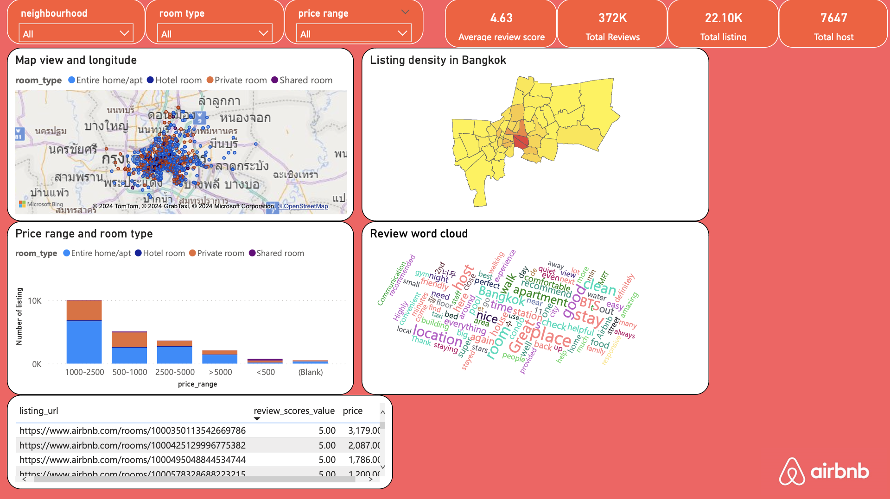
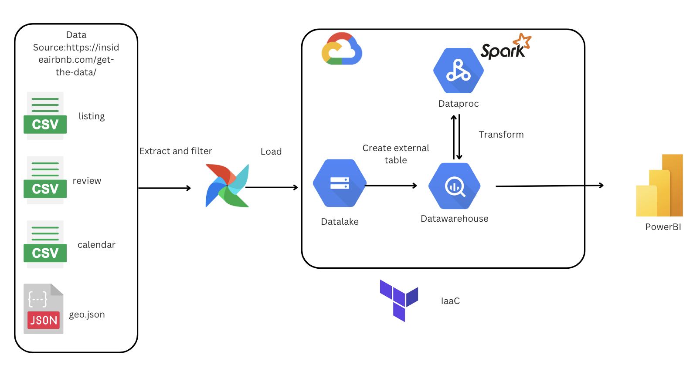

# project-dezoomcamp2024 by Pathorn

## Problem Description

This project aims to extract Bangkok Airbnb data to build a pipeline for visualizing the data for tourists who will be booking or seeking a place to stay in Bangkok.

### Main Problem

Tourists often have no idea where to stay in Bangkok. Some places might be priced too high, while others might be overrated.

Tourists visiting Bangkok often face challenges in finding suitable accommodations. With a multiple of options available on platforms like Airbnb, tourists may struggle to make informed decisions due to several factors:

1. **Lack of Information**: Tourists may not have access to comprehensive information about various accommodations in Bangkok, including pricing, amenities, location, and reviews.

2. **Uncertainty in Pricing**: The pricing of accommodations can vary significantly across different listings, leading to confusion among tourists about what constitutes a reasonable price for their stay.

3. **Quality Discrepancies**: While some accommodations may appear appealing based on their descriptions or photos, the actual quality may not meet expectations, leading to disappointment and dissatisfaction among tourists.

4. **Risk of Overpaying**: Without proper insights into the market rates and quality of accommodations, tourists may end up overpaying for their stay, resulting in unnecessary expenditure.

5. **Difficulty in Decision Making**: The abundance of choices coupled with the lack of transparent information makes it challenging for tourists to make well-informed decisions about where to stay in Bangkok.

### Solution

This project provides a dashboard that users can filter to choose the neighborhood, room type, and price range of listings. The dashboard is shown in the figure below:



For the geo plot, it shows the density of listings in each neighborhood and provides alternative listings for users to choose from within the filter values. The distribution plot displays the number of listings in price ranges separated by room type. Lastly, there's a word cloud of reviews. Additionally, a table ranks listing URLs based on the best review score value.

## Workflow



## Terraform

```bash
cd terraform
```

Rename your gcp-service-accounts-credentials file to `google_credentials.json` & store it in your directory
```bash
export GOOGLE_APPLICATION_CREDENTIALS= "<path to your key>"
```

```bash
terraform init
```

```bash
terraform plan
```

```bash
terraform apply
```

Remove the services

```bash
terraform destroy
```

## Airflow

```bash
cd airflow
```

Rename your gcp-service-accounts-credentials file to `google_credentials.json` & store it in your `$HOME` directory
    ``` bash
        cd ~ && mkdir -p ~/.google/credentials/
        mv <path/to/your/service-account-authkeys>.json ~/.google/credentials/google_credentials.json
    ```

Build the image (only first-time, or when there's any change in the `Dockerfile`):
     ```bash
     docker-compose build
     ```

Start all the services from the container:
    ```bash
    docker-compose up
    ```

After start the services you can access web UI on `http://0.0.0.0:8080` User name and password are both `airflow`

Shut down the container:
    ```bash
    docker-compose down
    ```
